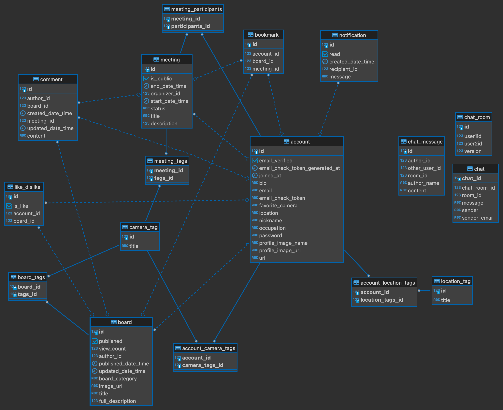

# 📸 Vintage Camera Community Project

안녕하세요, 빈티지 카메라 커뮤니티 프로젝트입니다.

## 📜 프로젝트 기획 동기
빈티지 카메라 애호가들이 모여서 정보를 공유하고, 리뷰를 작성하며, 자신의 카메라를 자랑할 수 있는 플랫폼을 제공합니다. 저는 빈티지 카메라를 수집하는 취미를 가지고 있는데, 생각보다 정보가 적어서 해당 커뮤니티 사이트를 만들면 좋겠다고 생각했습니다. 이 프로젝트는 빈티지 카메라를 좋아하는 사람들이 정보를 쉽게 공유하고, 서로의 카메라를 감상하며 소통할 수 있도록 돕기 위해 기획되었습니다.

## 🎯 프로젝트 핵심 기능
- **Spring Security를 활용한 사용자 인증 및 권한 관리 시스템 구현**
- **JavaMail API를 이용한 회원가입 이메일 인증 시스템 구현**
  - 해당 이메일로 인증메일 전송
- **JPA를 활용한 객체-관계 매핑(ORM) 및 효율적인 데이터베이스 접근 구현**
- **게시글 관련 좋아요, 북마크, 댓글 기능을 추가**
  - 동시에 여러 사용자가 좋아요를 누를 때 발생할 수 있는 문제를 방지하기 위해 비관적 락 추가
  - 게시글 검색 성능 개선을 위한 인덱스 기능 추가
- **STOMP를 이용한 실시간 채팅 구현**
- **Prometheus 및 Grafana를 이용한 모니터링 및 성능 분석**

## 🚀 프로젝트 사용기술
- Java
- Spring Boot
- PostgreSQL
- JPA
- Thymeleaf
- JUnit5
- AWS EC2
- Prometheus 
- Grafana


## 🗺️ 프로젝트 ERD 구성
프로젝트의 ERD(Entity Relationship Diagram)는 다음과 같습니다:



## 🌐 환경 구축 구성


## 🛠️ 로컬 환경에서 설치 및 실행 방법
저장소를 클론합니다.

```sh
git clone https://github.com/f-lab-edu/vintage-camera-community.git
```
프로젝트 디렉토리로 이동합니다.

```sh
cd vintage-camera-community
```
필요한 종속성을 설치합니다.


데이터베이스와 사용자를 생성합니다. PostgreSQL 콘솔에서 다음 명령어를 실행합니다.

```sql

CREATE DATABASE vincamo;
CREATE USER vincamouser WITH ENCRYPTED PASSWORD 'vincamo0126';
GRANT ALL PRIVILEGES ON DATABASE vincamo TO vincamouser;
```

데이터베이스 설정을 합니다. application-dev.properties 파일을 열어 PostgreSQL 설정 확인을 해줍니다.

```properties
spring.datasource.url=jdbc:postgresql://localhost:5432/vincamo
spring.datasource.username=vincamouser
spring.datasource.password=vincamo0126
```

/vintage-camera-community/src/main/resources 위치에
application-email.properties 파일을 생성하고 다음 설정을 추가합니다.

```properties
# google email SMTP setting
spring.mail.host=smtp.gmail.com
spring.mail.port=587
spring.mail.username=yourEmail
spring.mail.password=SMTP password
spring.mail.properties.mail.smtp.auth=true
spring.mail.properties.mail.smtp.timeout=5000
spring.mail.properties.mail.smtp.starttls.enable=true
```

필요한 종속성을 설치합니다.
```sh
./gradlew build
```

애플리케이션을 실행합니다.

```sh
./gradlew bootRun
```


